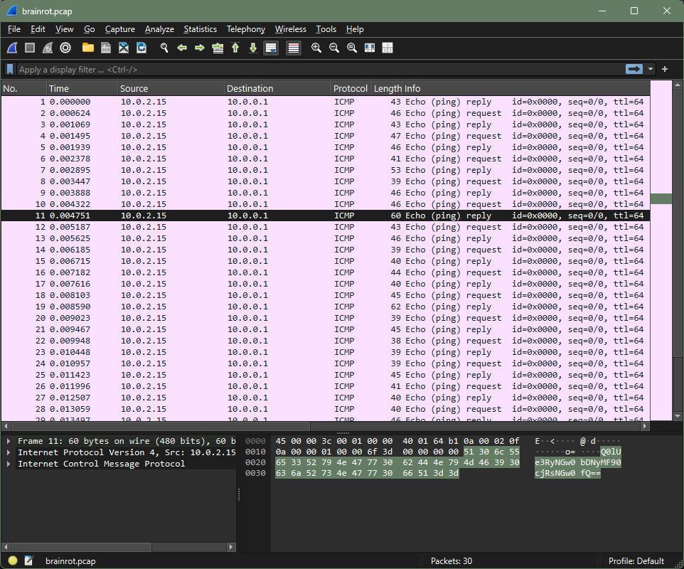

# Brainrot Quiz! - Writeup

| Author           | Title             | Category   | Difficulty |
|------------------|-------------------|------------|------------|
| barrythecanary | Brainrot Quiz! | forensics | - |

## Description

Bombardiro Crocodillo or....? You find out...

## Attachments

[brainrot.pcap](./brainrot.pcap)

## Solution

Looking at the file with wireshark I just had to go through the packages till I found one that looked interesting:

The data looked like it was base64 encoded so after decoding it we got our flag:

`CIT{tr4l4l3r0_tr4l4l4}`