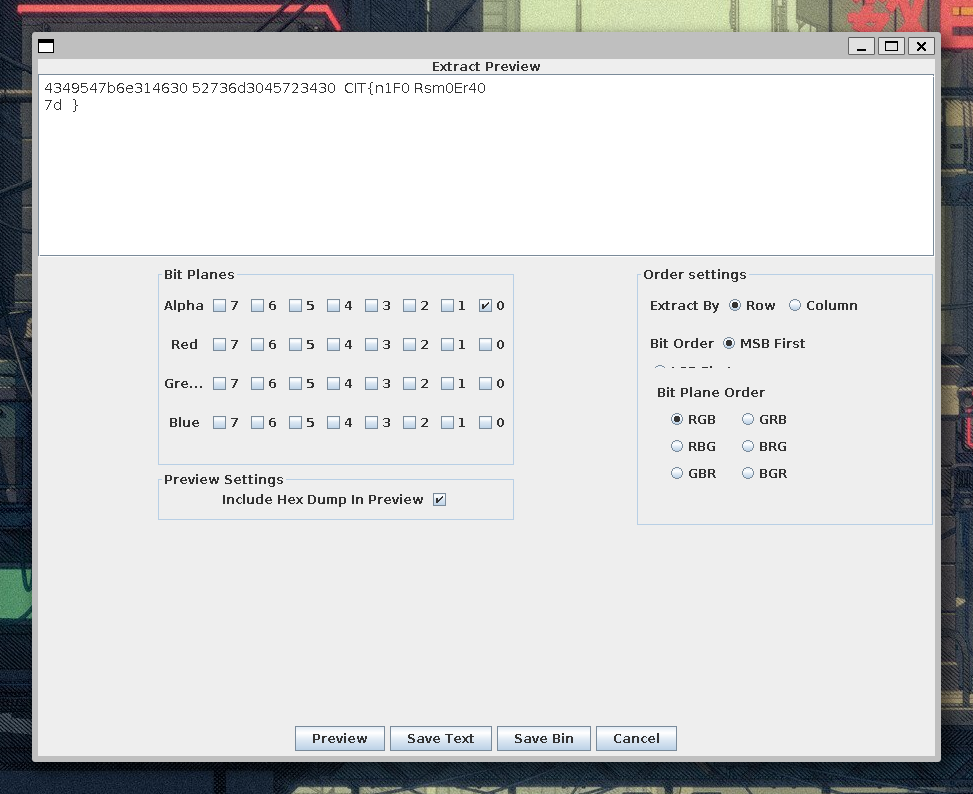

# Blank Image - Writeup

| Author           | Title             | Category   | Difficulty |
|------------------|-------------------|------------|------------|
| barrythecanary | Blank Image | steganography | - |

## Description

I was gonna make a really cool challenge but then I literally forgot about it so all I have is this blank image. Good luck!

## Attachments

[image.png](./image.png)

## Solution

I first looked at it with file and binwalk and found nothing suspicious, except that file said it's an extremly tiny picture 8x17.

I ran strings on it and found nothing so I opened it with StegSolve and found it immediately when I looked at alpha channel 0.

Flag: `CIT{n1F0Rsm0Er40}`