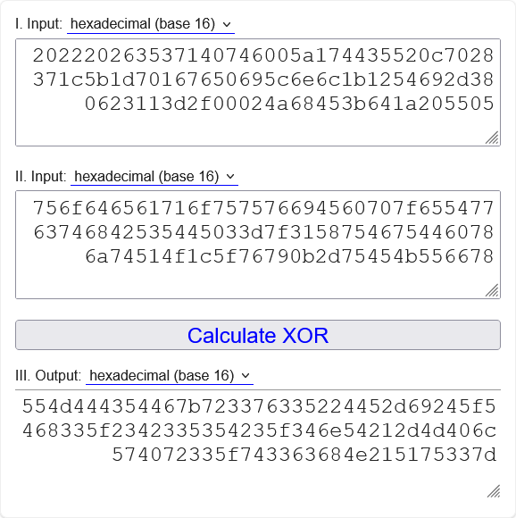
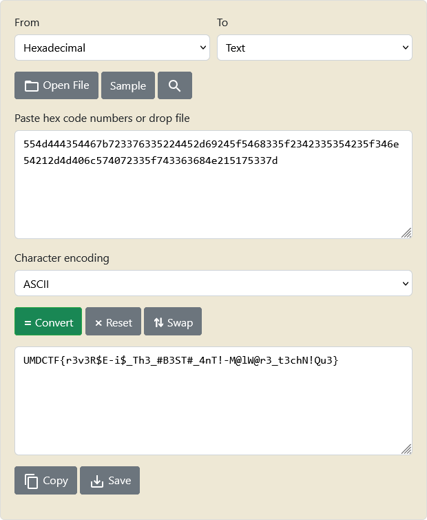

# deobfuscation - Writeup

| Author           | Title             | Category   | Difficulty |
|------------------|-------------------|------------|------------|
| barrythecanary | deobfuscation | reverse engineering | - |

## Description

the chall is not that complex. the key is to read ASSEMBLY!

## Attachments

[flag](./flag)

## Solution

Running file on the application shows it's a 64-bit binary.

```
$ file flag
flag: ELF 64-bit LSB executable, x86-64, version 1 (SYSV), statically linked, stripped
```

I looked for anything flag like with strings before throwing it into a decompiler.

```
$ strings flag
4u@H1
 " &57
vPi\nl
Ti-8
JhE;d
uodeaqouuviE`p
eTwcthBSTE
1XuFuD`xjtQO
-uEKUfxEnter the password: 
Correct! 
Wrong password.   
.shstrtab
.text
.data
.bss
```

As you can see the program seems to be a simple password checker. Looking at the decompiled code I found the following:

```
void processEntry entry(void)

{
  long lVar1;
  long lVar2;
  
  syscall();
  syscall();
  for (lVar1 = 0; (&DAT_0040209c)[lVar1] != 10; lVar1 = lVar1 + 1) {
    *(byte *)(lVar1 + 0x40211c) = (&DAT_0040209c)[lVar1] ^ *(byte *)(lVar1 + 0x402034);
  }
  if (lVar1 == 0x34) {
    lVar1 = 0;
    do {
      lVar2 = lVar1;
      if ((&DAT_00402000)[lVar2] != *(char *)(lVar2 + 0x40211c)) goto code_r0x0040109a;
      lVar1 = lVar2 + 1;
    } while (lVar2 + 1 < 0x34);
    *(undefined1 *)(lVar2 + 0x40209d) = 0;
    syscall();
  }
  else {
code_r0x0040109a:
    syscall();
  }
  syscall();
                    /* WARNING: Bad instruction - Truncating control flow here */
  halt_baddata();
}
```

To put it simply, the input is taken and XORed with 52 bytes starting in memory location `0x402034` and then each byte is compared to the 52 bytes starting at memory location `0x402000`.

This means all we have to do is take the 52 bytes from memory location `0x402034` and XOR them with the 52 bytes in `0x402000`.
This then gives us the flag.

To get the 52 bytes from both locations we can just use xxd and print 104 bytes starting from offset 0x2000 because 0x34 in decimal is 52, meaning the second byte array starts right after the first:

```
$ xxd -s 0x2000 -p -l 104 -c 52 flag 
202220263537140746005a174435520c7028371c5b1d70167650695c6e6c1b1254692d380623113d2f00024a68453b641a205505
756f646561716f757576694560707f65547763746842535445033d7f31587546754460786a74514f1c5f76790b2d75454b556678
```

XORing them gives us:





The flag: `UMDCTF{r3v3R$E-i$_Th3_#B3ST#_4nT!-M@lW@r3_t3chN!Qu3}`